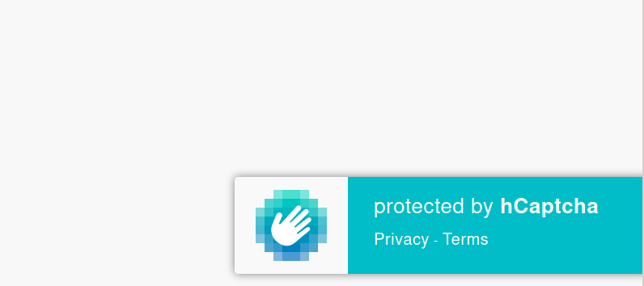

# hcaptcha-badge-unofficial
Plain JS badge for invisible hcaptcha. Inspired by reCaptcha badge.

## Usage
Copy the js file into site folder and add it's relative path with a script tag just before `</body>` tag.

`<script type="text/javascript" src="/hcaptcha-badge.js" />`

## Screenshot

